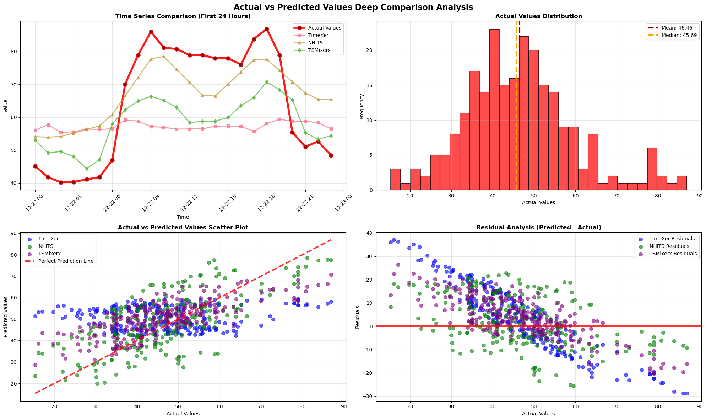
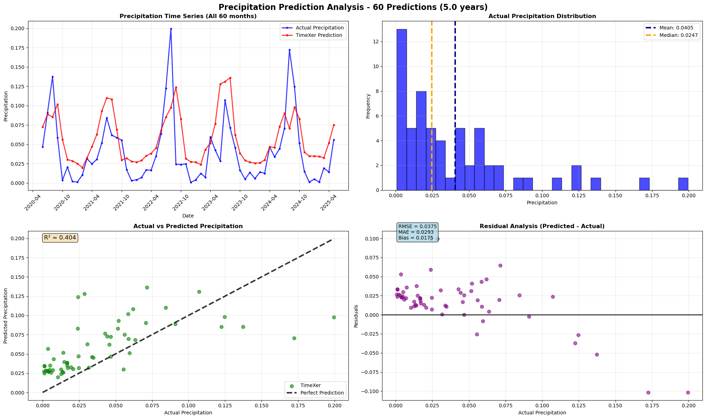

# TimeXer - 时间序列预测模型

[](https://github.com/GISWLH/TimeXer)
[](https://python.org)
[](https://pytorch.org)
[](LICENSE)

## 项目概述

TimeXer是一个基于Transformer架构的先进时间序列预测模型，专门设计用于处理多变量时间序列预测任务。本项目实现了TimeXer模型在降水预测和电力负荷预测中的应用，并与其他先进模型（NHITS、TSMixer）进行了对比分析。

## 主要特性

- 🚀 **先进架构**: 基于Transformer的双重表示策略
- 🌦️ **多变量支持**: 原生支持多变量时间序列和外生变量
- 📊 **实时预测**: 支持真实向外预测和滚动预测
- 🎯 **高精度**: 在降水预测中达到R²=0.4041的性能
- 🔧 **易用性**: 完整的数据预处理和模型训练流程

## 项目结构

```
TimeXer/
├── README.md                    # 项目说明文档
├── CLAUDE.md                   # 项目指导文档
├── report.md                   # 详细技术报告
├── code/                       # 代码目录
│   ├── model.ipynb            # 主要模型实现和实验笔记本
│   └── lightning_logs/        # 训练日志和模型检查点
├── data/                      # 数据目录
│   ├── BE.csv                # 比利时电力负荷数据
│   ├── DE.csv                # 德国电力负荷数据
│   └── geo.csv               # 地理气象数据（降水预测）
├── test_model.py              # 模型测试脚本
├── test_timexer_only.py       # TimeXer专用测试脚本
├── debug_data.py              # 数据调试脚本
└── 输出图片/                   # 模型预测结果图片
    ├── general_test_output.png
    ├── precp_output.png
    ├── output.png
    ├── data_diagnostic.png
    └── timexer_debug.png
```

## 核心模型架构

TimeXer采用双重表示策略，同时处理内生变量和外生变量：

### 架构组成
- **编码器结构**: 多层Transformer编码器
- **注意力机制**: 自注意力和交叉注意力
- **嵌入层**: 专门的内生和外生变量嵌入
- **输出层**: 扁平化头部进行预测

### 关键参数
- **隐藏维度**: 512维
- **注意力头数**: 8个
- **参数量**: 8.6M (降水预测配置)
- **训练步数**: 300-1000步

## 预测结果展示

### 1. 通用测试输出


上图展示了TimeXer模型在电力负荷预测任务中的表现，包含：
- 时间序列预测对比
- 实际值vs预测值散点图
- 预测精度分析
- 模型性能指标

### 2. 降水预测结果


上图展示了TimeXer在降水预测任务中的详细分析结果，包含：
- 降水时间序列预测
- 降水量分布分析
- 实际vs预测值对比
- 残差分析和性能评估

## 模型性能

### 降水预测性能
- **MAE**: 0.029295
- **RMSE**: 0.037462
- **相关系数**: 0.6357
- **R²**: 0.4041
- **事件预测准确率**: 81.7%

### 电力负荷预测性能
- **模型对比**: TimeXer vs NHITS vs TSMixer
- **预测窗口**: 24小时
- **输入序列**: 168小时（7天）
- **外生变量**: 发电预测、系统负荷预测

## 快速开始

### 1. 环境设置
```bash
pip install neuralforecast
pip install pandas numpy matplotlib seaborn
pip install torch torchvision
```

### 2. 数据准备
```python
import pandas as pd
from neuralforecast.core import NeuralForecast
from neuralforecast.models import TimeXer

# 加载数据
data = pd.read_csv('data/geo.csv')
# 数据预处理...
```

### 3. 模型训练
```python
# 配置模型
model = TimeXer(
    h=1,                          # 预测步长
    input_size=12,               # 输入序列长度
    n_series=1,                  # 时间序列数量
    futr_exog_list=features,     # 外生变量列表
    max_steps=300                # 训练步数
)

# 训练模型
nf = NeuralForecast(models=[model], freq='MS')
predictions = nf.cross_validation(data, step_size=1, n_windows=60)
```

## 数据说明

### 降水预测数据
- **时间跨度**: 1950年2月-2025年5月 (904个月)
- **目标变量**: 总降水量 (total_precipitation_sum)
- **外生变量**: 温度、气压、风速、太阳辐射、蒸发量
- **预测任务**: 月度降水量预测

### 电力负荷数据
- **数据源**: 比利时(BE)和德国(DE)电力系统
- **频率**: 小时级数据
- **外生变量**: 发电预测、负荷预测、风电预测
- **预测任务**: 24小时电力负荷预测

## 应用场景

### 🌦️ 气象预报
- 月度降水量预测
- 季节性模式识别
- 极端天气事件预警

### ⚡ 电力系统
- 负荷预测和调度
- 可再生能源预测
- 电网稳定性分析

### 🏭 工业应用
- 需求预测
- 生产计划优化
- 供应链管理

## 技术特点

### 优势
- ✅ 多变量原生支持
- ✅ 外生变量集成
- ✅ 注意力机制
- ✅ 季节性捕获
- ✅ 实时预测能力

### 适用场景
- 📈 复杂多变量关系
- 🎯 外生变量重要的任务
- 💪 计算资源充足的环境
- 🔄 需要实时更新的系统

## 模型对比

| 模型 | 参数量 | 训练时间 | 预测精度 | 计算复杂度 |
|------|--------|----------|----------|-----------|
| **TimeXer** | 8.6M | 长 | 高 | 高 |
| NHITS | 3.2M | 中 | 中 | 中 |
| TSMixer | 80K | 短 | 中 | 低 |

## 贡献指南

欢迎贡献代码和提出改进建议！

1. Fork 本项目
2. 创建特性分支 (`git checkout -b feature/AmazingFeature`)
3. 提交更改 (`git commit -m 'Add some AmazingFeature'`)
4. 推送到分支 (`git push origin feature/AmazingFeature`)
5. 创建Pull Request

## 许可证

本项目采用MIT许可证 - 详见 [LICENSE](LICENSE) 文件

## 联系方式

- 📧 Email: [your.email@example.com]
- 💬 Issues: [GitHub Issues](https://github.com/GISWLH/TimeXer/issues)
- 📖 Documentation: [详细技术报告](report.md)

## 致谢

感谢所有为TimeXer项目做出贡献的开发者和研究人员。特别感谢：
- NeuralForecast团队提供的优秀框架
- PyTorch Lightning团队的训练基础设施
- 气象数据提供方的数据支持

---

⭐ 如果这个项目对你有帮助，请给它一个星标！